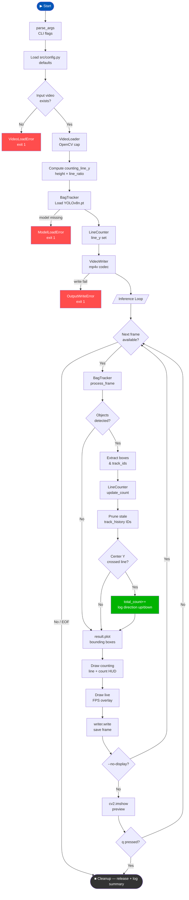

<div align="center">

# BagCount-V1

**An Industry-Standard Computer Vision Pipeline for Real-Time Bag Detection and Counting**

</div>

---

## Demo

### Raw Input


### Annotated Output 


### What changed between input and output

| | Raw Input | Annotated Output |
|---|---|---|
| **Bags** | Plain footage | Bounding boxes + track IDs on every bag |
| **Counting line** | Not visible | Green horizontal line at 40% of frame height |
| **Live count** | None | Red `Bags Counted: N` in top-left corner |
| **FPS** | None | Yellow FPS counter |
| **Console** | Silent | Timestamped log with direction (↑↓), ID, running total |

### Console output from test run

```
[14:25:41] INFO  — Video loaded — 4096x2160 @ 24 fps, ~401 frames
[14:25:41] INFO  — Counting line placed at Y=864 (ratio=0.40 of height=2160)
[14:28:45] INFO  — Bag counted ↓  ID=77   total=1
[14:28:57] INFO  — Bag counted ↑  ID=122  total=2
[14:29:18] INFO  — Total bags counted : 2
[14:29:18] INFO  — Output video saved : data/processed/output.mp4
```

---

## Problem Statement

In high-traffic environments such as airport luggage carousels, retail spaces, and security checkpoints, manually counting and tracking bags is inefficient and prone to human error. There is a need for an automated, scalable solution that can accurately detect, track, and count specific objects (backpacks, handbags, suitcases) in real-time video feeds without double-counting items that briefly leave and re-enter the camera frame.

## The Solution

BagCount-V1 is a modular computer vision pipeline that uses a state-of-the-art object detection model coupled with a robust tracking algorithm. The system draws a virtual counting line across the video frame and detects when the center point of a tracked bag crosses this threshold, ensuring accurate, deduplicated counting.

---

## Model

| Component | Detail |
|-----------|--------|
| Architecture | YOLOv8 Nano (`yolov8n.pt`) via Ultralytics |
| Tracker | ByteTrack — assigns unique persistent IDs to moving objects |
| Dataset | COCO pretrained |
| Target classes | 24 Backpack · 26 Handbag · 28 Suitcase |

---

## System Pipeline

1. **Data Ingestion** — Reads video frame-by-frame via OpenCV.
2. **Inference & Tracking** — YOLOv8 detects bags; ByteTrack assigns a unique ID to each.
3. **Mathematical Logic** — Continuously updates each bounding box's center Y-coordinate.
4. **Line-Crossing Detection** — If a bag crosses the virtual threshold (either direction), the master counter increments and the ID is marked as counted.
5. **Output Generation** — Renders bounding boxes, track IDs, the counting line, live FPS, and count onto the video and exports as `.mp4`.

---

## Project Structure

```
bagcount/
├── data/
│   ├── raw/               # Input videos (e.g. test_video.mp4)
│   └── processed/         # Annotated output videos
├── models/                # YOLO .pt weights
├── src/                   # Core pipeline modules
│   ├── config.py          # Hyperparameters & thresholds
│   ├── data_loader.py     # OpenCV video handling
│   ├── tracker.py         # YOLOv8 inference & ByteTrack
│   ├── counter.py         # Line-crossing mathematics
│   ├── exceptions.py      # Custom exception hierarchy
│   └── logger.py          # Centralised logger factory
├── scripts/
│   ├── run_inference.py   # Main execution entry-point (CLI)
│   ├── train.py           # Fine-tuning script
│   └── evaluate.py        # Metrics generation (mAP, Precision)
├── requirements.txt
└── README.md
```

---

## Architecture & Workflow



---

## Setup & Execution

### 1. Install dependencies

```bash
pip install -r requirements.txt
```

### 2. Add your video

Place the input video inside `data/raw/` and name it `test_video.mp4`.

### 3. Run the pipeline

```bash
# Default — uses settings from src/config.py
python scripts/run_inference.py

# Custom input/output paths
python scripts/run_inference.py --input data/raw/airport.mp4 --output data/processed/out.mp4

# Move the counting line to 60 % of frame height
python scripts/run_inference.py --line-ratio 0.6

# Higher confidence, headless (no display window)
python scripts/run_inference.py --conf 0.40 --no-display
```

### CLI flags

| Flag | Default | Description |
|------|---------|-------------|
| `--input PATH` | `config.VIDEO_PATH` | Input video file |
| `--output PATH` | `config.OUTPUT_PATH` | Annotated output video |
| `--line-ratio FLOAT` | `0.40` | Counting line as fraction of frame height (0–1) |
| `--conf FLOAT` | `0.25` | Detection confidence threshold (0–1) |
| `--no-display` | off | Disable live preview window (headless mode) |

---

## Output

Upon completion (or early exit with `q`), the annotated video with bounding boxes, track IDs, counting line, FPS, and total count is saved to `data/processed/output.mp4`. Each bag crossing is also logged to the console with its direction and running total.
