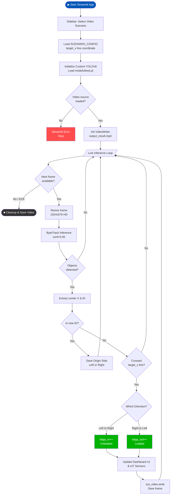

<div align="center">

# Warehouse-BagCount-V1

**An Industry-Standard Computer Vision Pipeline for Real-Time Bag Detection and Counting**

</div>

---

## Demo

### Raw Input


https://github.com/user-attachments/assets/44060c5f-21ed-4326-a181-8ecb68dc6b27


### Annotated Output 


https://github.com/user-attachments/assets/0d04e9ea-bcd2-48ce-a1bc-fc38111882a5


### What changed between input and output

| | Raw Input | Annotated Output |
|---|---|---|
| **Sacks** | Plain footage | Green bounding boxes + persistent track IDs (via ByteTrack) |
| **Counting line** | Not visible | **Yellow vertical trigger line** separating Truck and Door zones |
| **Live count** | None | Streamlit dashboard cards for bi-directional counts (`📥 Unloaded` & `📤 Loaded`) |
| **Environment Data** | None | Live simulated Facility IoT Sensors (Temperature, Humidity, Gas Levels) |
| **Visual HUD** | Clean feed | On-screen translucent directional labels (`<- TRUCK ZONE` and `DOOR ZONE ->`) |


---

## Problem Statement

In high-volume logistics centers and warehouse loading bays, manually tallying bulk goods and sacks during the loading and unloading process is inefficient, labor-intensive, and prone to human error. There is a critical need for an automated, scalable Computer Vision solution capable of accurately detecting, tracking, and counting specific items (sacks/bags) in real-time video feeds. The system must robustly handle complex environments—including worker occlusion, multi-gate camera angles, and bi-directional traffic—to flawlessly distinguish between items being unloaded (Truck to Warehouse) and loaded (Warehouse to Truck) without double-counting or falsely tracking empty-handed personnel.

## The Solution

**Warehouse-BagCount-V1** is an enterprise-grade computer vision pipeline integrated into a real-time Streamlit dashboard. Powered by a custom-trained YOLOv8 model and the high-persistence ByteTrack algorithm, the system establishes a vertical "choke-point" trigger line to monitor the origin side and trajectory of every detected sack. By utilizing Origin-Side Memory logic, the system accurately distinguishes between bi-directional movements—flawlessly counting both Unloading (Truck to Warehouse) and Loading (Warehouse to Truck) operations simultaneously. This approach inherently ignores empty-handed workers, prevents double-counting, and outputs live metrics alongside facility IoT data.

---

## Model

| Component | Detail |
|-----------|--------|
| Architecture | YOLOv8 Custom (`custom_sack_v1.pt` / `best.pt`) via Ultralytics |
| Tracker | ByteTrack — High persistence configured with `conf=0.05` to prevent ID dropping during motion blur and worker occlusion |
| Dataset | Custom Warehouse Domain (Fine-tuned specifically for industrial loading bay sacks) |
| Target classes | Sack / Bag (Custom Class) |

---

## System Pipeline

1. **Data Ingestion & Normalization** — Reads video frame-by-frame via OpenCV and resizes the feed to 1024x576 HD to preserve the physical aspect ratio of the sacks.
2. **Inference & Tracking** — A custom YOLOv8 model detects sacks using an optimized low-confidence threshold (`0.05`); ByteTrack assigns a highly persistent unique ID to handle worker occlusion and motion blur.
3. **Trajectory & Origin Memory** — Computes the center X-coordinate of each bounding box and records its initial starting zone ("Origin Side") relative to a vertical choke-point line.
4. **Bi-Directional Crossing Logic** — Evaluates if an ID has crossed the vertical threshold. Based on the movement vector, it strictly increments either the **Unloaded** (Truck → Warehouse) or **Loaded** (Warehouse → Truck) counter, completely ignoring empty-handed workers.
5. **Dashboard Output** — Renders the tracking boxes, vertical counting line, and translucent UI HUD onto the live Streamlit interface, alongside real-time directional metrics and simulated facility IoT data.

---

## Project Structure

```
bagcount/
├── data/
│   ├── raw/               # Input videos (e.g. Problem_Statement_Scenario.mp4)
│   └── processed/         # Annotated output videos
├── models/                # YOLO .pt weights
│   ├── best.py
├── src/                   # Core pipeline modules
│   ├── config.py          # Hyperparameters & thresholds
│   ├── data_loader.py     # OpenCV video handling
│   ├── tracker.py         # YOLOv8 inference & ByteTrack
│   ├── counter.py         # Line-crossing mathematics
│   ├── exceptions.py      # Custom exception hierarchy
│   └── logger.py          # Centralised logger factory
├── scripts/
│   ├── run_inference.py   # Main execution entry-point (CLI)
│   ├── train.py           # Fine-tuning script
│   └── evaluate.py        # Metrics generation (mAP, Precision)
├── app.py
├── yolov8n.pt
├── requirements.txt
└── README.md
```

---


## Architecture & Workflow



---

## Setup & Execution

### 1. Install dependencies

```bash
pip install -r requirements.txt
```

### 2. Add your video

Place the input video inside `data/raw/` and name it `Problem Statement Scenario.mp4`.

### 3. Run the pipeline

Launch the interactive dashboard using Streamlit:

```bash
streamlit run app.py


# Dashboard Controls & Configuration
  Instead of passing command-line arguments, the system is now controlled directly through the UI and a simple config dictionary:

# Switching Videos: Use the dropdown menu in the left sidebar of the web dashboard to instantly switch between different warehouse scenarios (Loading, Unloading,     Gate Perspective).

# Moving the Counting Line: To adjust the vertical trigger line for a specific camera angle, open app.py and modify the SCENARIO_CONFIG dictionary at the top of      the file:
```bash
# Inside app.py
SCENARIO_CONFIG = {
    "Scenario 1 (Active Loading)": {
        "path": "data/raw/Problem Statement Scenario1.mp4",
        "center_line": 580  # Decrease to move LEFT, Increase to move RIGHT
    }
}

# Video Export: The system automatically renders the annotated frames and provides a "Download Result Video" button directly in the dashboard sidebar once         processing completes.
```

### Dashboard Controls & Parameters

The command-line interface (CLI) has been replaced with an intuitive Streamlit UI and a centralized configuration dictionary in `app.py`.

| Feature | New Control Method | Description |
|------|---------|-------------|
| **Input Video** | UI Sidebar Dropdown | Select between pre-configured warehouse scenarios instantly. |
| **Output Video** | UI Download Button | Automatically generates an `.mp4` available in the sidebar after processing. |
| **Counting Line** | `SCENARIO_CONFIG` in `app.py` | Set the X-coordinate (`center_line`) for the vertical trigger zone. |
| **Confidence** | Optimized in Code | Hardcoded to `conf=0.05` to guarantee maximum ByteTrack persistence during motion blur. |
| **Live Display** | Native Streamlit UI | Real-time annotated feed displayed directly alongside IoT metrics in the browser. |

---

## Output

During execution, the Streamlit dashboard provides a live, annotated video feed alongside continuously updating metric cards for bi-directional sack movement (📥 **Unloaded** and 📤 **Loaded**) and simulated facility IoT telemetry. 

Upon completion of the video stream, the fully processed video—complete with bounding boxes, persistent ByteTrack IDs, the vertical trigger line, and zone HUD overlays—is automatically compiled. Users can seamlessly save the result locally using the **"📥 Download Result Video"** button that appears in the sidebar.
